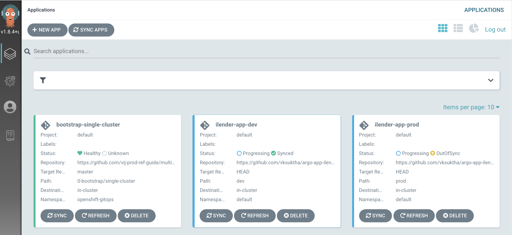
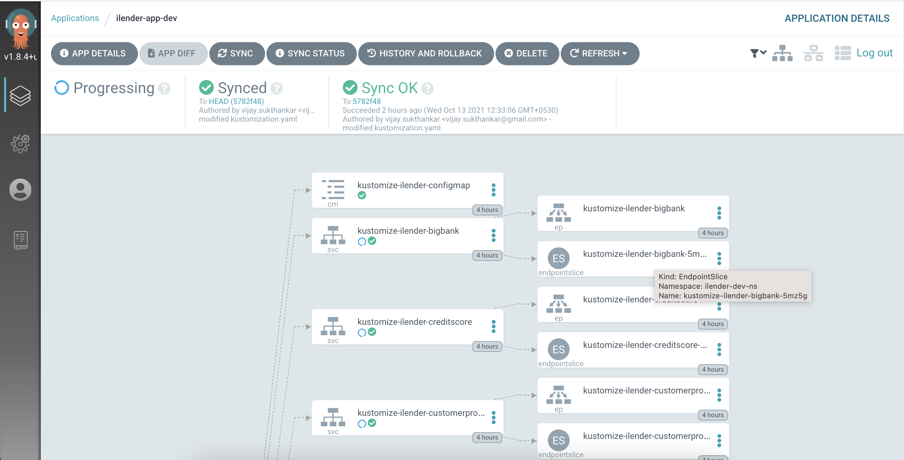

# Deploy iLender app with GitOps using ArgoCD and Kustomize

This document explains GitOps way of deploying iLender application in Dev and Prod clusters using ArgoCD.

- ArgoCD is installed and available in an Openshift Cluster. 
- iLender app is going to be deployed in `in-cluster`, the Openshift Cluster where ArgoCD is installed.
- The namespaces `ilender-dev-ns` and `ilender-prod-ns` are considered as Dev and Prod `in-cluster`s .

## 1. Yamls

### 1.1 iLender application

iLender application yaml files are in [base ](base)  

The delta for Dev and Prod are available here.

[Dev ](dev) 

[Prod ](prod) 


### 1.2 ArgoCD application

We need to create an entry (application) in ArgoCD, to point to iLender application. For each Dev and Prod `in-cluster` of iLender, we need to have separate entry (application) in ArgoCD. Here the yamls to create app in ArgoCD.

[ilender-dev ](argo-app/ilender-app-dev.yaml) 

[ilender-prod ](argo-app/ilender-app-prod.yaml) 

The ArgoCD appplication looks like the below.



## 2. Create ArgoCD application

Create ArgoCD application for Dev and Prod

Run the below commands

```
oc apply -f argo-app/ilender-app-dev.yaml
oc apply -f argo-app/ilender-app-prod.yaml
```

## 3. Deploy iLender

### 3.1 Deploy iLender in Dev

1. Click on sync option to install iLender app in `Dev` in-cluster for the first time.

The iLender application might have been deployed and you might be able to see the app like this in ArgoCD.



### 3.2. Deploy iLender in Prod

1. Click on sync option to install iLender app in `Prod` in-cluster for the first time.

The iLender application might have been deployed and you might be able to see the app in ArgoCD.

